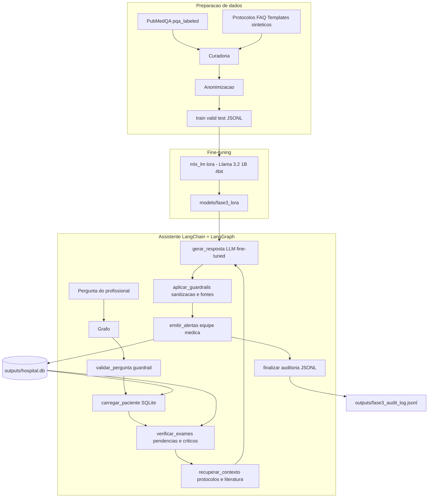

# Arquitetura — Fase 3: Assistente Médico

## Visão geral

## Componentes

| Módulo | Responsabilidade |
|--------|------------------|
| `assistente_medico/config.py` | Paths, env, limites de segurança, resolução de backend LLM |
| `assistente_medico/data/anonymize.py` | Remoção de PII (CPF, RG, telefone, e-mail, nomes, datas) |
| `assistente_medico/data/synthetic_hospital.py` | Protocolos, FAQ e templates internos sintéticos |
| `assistente_medico/data/prepare_dataset.py` | Download PubMedQA + curadoria + split + JSONL chat |
| `assistente_medico/fine_tuning/train_lora.py` | Fine-tuning LoRA via `mlx_lm lora` |
| `assistente_medico/fine_tuning/evaluate.py` | Avaliação before/after (acurácia, fontes, segurança) |
| `assistente_medico/db/` | SQLite: pacientes, exames, prescrições pendentes, alertas |
| `assistente_medico/assistant/llm.py` | Wrapper LLM: MLX fine-tuned / Ollama / stub offline |
| `assistente_medico/assistant/retrieval.py` | Base de conhecimento lexical (protocolos + PubMedQA) |
| `assistente_medico/assistant/tools.py` | Tools LangChain de consulta estruturada |
| `assistente_medico/assistant/guardrails.py` | Bloqueio de prescrição/diagnóstico/PII; sanitização |
| `assistente_medico/assistant/explainability.py` | Consolidação de fontes por resposta |
| `assistente_medico/assistant/logging_audit.py` | Log JSONL de auditoria por interação |
| `assistente_medico/assistant/graph.py` | Grafo LangGraph (8 nós, roteamento condicional) |
| `assistente_medico/pipeline.py` | Orquestração e cenários de demonstração |
| `main_fase3.py` | CLI: prepare / seed-db / train / evaluate / demo / ask |

## Fluxo LangGraph

O grafo (`StateGraph` do LangGraph) tem 8 nós. O nó `validar_pergunta` roteia
condicionalmente: pedidos que violam os limites de atuação (prescrição direta,
diagnóstico definitivo, PII) vão direto para `finalizar` com recusa explícita e
auditoria; os demais percorrem o fluxo completo com contexto do paciente.

Cada nó anexa sua etapa ao estado (`etapas`), permitindo rastrear a execução
completa em cada registro de auditoria.

## Segurança (limites de atuação)

1. O assistente **nunca prescreve**: pedidos de prescrição/ajuste de dose são
   bloqueados antes da LLM; respostas da LLM com posologia explícita são
   sanitizadas pelo guardrail de saída.
2. **Validação humana obrigatória**: toda resposta carrega
   `requer_validacao_humana=True` e disclaimer fixo.
3. **Privacidade**: pedidos de dados identificáveis são recusados; o dataset
   de treino passa por anonimização.
4. **Explainability**: toda resposta lista fontes (`protocolo:PROTO-XXX`,
   `pubmedqa:<pubid>`, `prontuario:<paciente>/<campo>`, `politica_seguranca`).
5. **Auditoria**: cada interação gera entrada JSONL com prompt, resposta bruta,
   violações, fontes, alertas e etapas do grafo.
