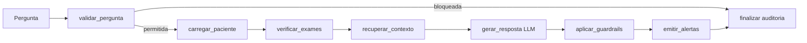

# Relatório Técnico — Tech Challenge Fase 3

## Assistente Médico com Fine-tuning de LLM + LangChain/LangGraph

---

## 1. Contexto e objetivo

Após a automação de análises de exames (Fases 1 e 2), o hospital avança para um
assistente virtual médico treinado com dados próprios, capaz de auxiliar em
condutas clínicas, responder dúvidas de médicos e sugerir procedimentos com
base nos protocolos internos — com fluxos de decisão automatizados e seguros
coordenados por LangChain/LangGraph.

## 2. Dados e curadoria (preprocessing, anonimização)

### 2.1 Fontes

| Fonte | Conteúdo | Tamanho |
|-------|----------|---------|
| **PubMedQA** (`qiaojin/PubMedQA`, `pqa_labeled`) | Q&A clínico revisado por especialistas, com contexto de abstracts | 800 exemplos curados |
| **Protocolos internos (sintéticos)** | 12 protocolos (sepse, dor torácica, TEV, AVC, contraste, etc.) | 12 exemplos |
| **FAQ de médicos (sintético)** | Perguntas frequentes mapeadas para protocolos | 15 exemplos |
| **Templates institucionais (sintéticos)** | Modelos de laudo, receita e procedimento | 5 exemplos |
| **Exemplos de segurança** | Recusas de prescrição/diagnóstico/PII | 4 exemplos (oversampling 10x no treino) |

Os dados "internos do hospital" são 100% sintéticos (hospital fictício), como
permite o enunciado ("dataset anonimizado **ou exemplo de dados sintéticos**").

### 2.2 Preprocessing e anonimização

- Conversão para formato **chat** (`system`/`user`/`assistant`), aceito pelo `mlx-lm`;
- **Anonimização** de todo texto via `assistente_medico/data/anonymize.py`:
  CPF, RG, telefone, e-mail, datas de nascimento, CEP, número de prontuário e
  nomes próprios precedidos de pronome de tratamento são substituídos por
  placeholders (`[CPF_REMOVIDO]`, `[NOME_REMOVIDO]`, ...);
- Curadoria: exemplos PubMedQA sem `long_answer` ou sem decisão válida são
  descartados; contextos truncados em 1500 caracteres;
- **Oversampling de segurança**: os 4 exemplos de recusa segura são replicados
  10x no treino para o modelo não "desaprender" os limites de atuação em meio
  aos ~800 exemplos de Q&A (decisão tomada após a 1ª rodada de avaliação — ver §5);
- Split reprodutível (seed 42): PubMedQA 80/10/10; exemplos internos ficam
  integralmente no treino por serem poucos e críticos.

Resultado: `data/training/{train,valid,test}.jsonl` (versionados no repo) +
cache bruto de curadoria em `data/raw/` (ignorado no git).

## 3. Fine-tuning

### 3.1 Configuração

| Item | Valor |
|------|-------|
| Modelo base | `mlx-community/Llama-3.2-1B-Instruct-4bit` (LLaMA, sugestão do enunciado) |
| Técnica | **LoRA** via `mlx_lm lora` (MLX, Apple Silicon) |
| Parâmetros treináveis | 0,114% (1,4M de 1,24B) |
| Iterações | 300 | 
| Batch size | 2 |
| Camadas com LoRA | 8 (últimas) |
| Learning rate | 1e-5 |
| Max seq length | 1024 |
| Duração | ~8 minutos (Mac Apple Silicon, pico ~3 GB RAM) |

A escolha de um modelo 1B quantizado em 4 bits + LoRA permite treinar e servir
o modelo localmente em um notebook de 16 GB, sem enviar dados médicos à nuvem.

### 3.2 Convergência

Val loss: 3.24 (inicial) → ~1.7 (final) — o modelo aprendeu o formato de
resposta com decisão + justificativa + citação de fonte.

Comando: `python main_fase3.py train --iters 300`. Log completo em
`outputs/fase3_train_log.txt`; adapter em `models/fase3_lora/`.

## 4. Assistente médico (LangChain + LangGraph)

### 4.1 Arquitetura

Diagrama completo em [`docs/arquitetura_fase3.md`](./arquitetura_fase3.md).



- **LLM customizada**: o wrapper (`assistant/llm.py`) usa o modelo fine-tuned
  (MLX + adapter) automaticamente; fallback para Ollama via `langchain-ollama`
  ou stub determinístico offline (CI).
- **Base estruturada** (requisito "consultas em base de dados estruturadas"):
  SQLite com `pacientes`, `exames`, `prescricoes_pendentes` e `alertas`,
  populado com 6 prontuários sintéticos. Tools LangChain (`assistant/tools.py`):
  `buscar_paciente`, `listar_exames_pendentes`, `listar_resultados_criticos`,
  `buscar_protocolo`, `registrar_alerta`.
- **Contextualização** (requisito "informações atualizadas do paciente"): o nó
  `gerar_resposta` injeta no prompt os dados clínicos atuais (alergias,
  comorbidades, medicamentos, hipótese diagnóstica), exames pendentes e
  resultados críticos lidos do banco no momento da pergunta.
- **Fluxo automatizado** (requisito LangGraph): ao receber informações de um
  paciente, o grafo verifica exames pendentes, recupera protocolos, sugere
  próximos passos e **emite alertas** para a equipe médica (resultados críticos
  seguem o PROTO-011: comunicação em até 30 min).

### 4.2 Segurança e validação

| Camada | Mecanismo |
|--------|-----------|
| Guardrail de entrada | Regex determinístico bloqueia pedidos de prescrição/ajuste de dose, diagnóstico definitivo e PII **antes** da LLM |
| Guardrail de saída | Sanitiza posologia explícita ("tome 500 mg...") e afirmações diagnósticas na resposta da LLM |
| Validação humana | `requer_validacao_humana=True` em **toda** resposta + disclaimer fixo |
| Dados de treino | Exemplos de recusa segura (oversampling) ensinam o próprio modelo a recusar |
| Privacidade | Anonimização no dataset; recusa de pedidos de dados identificáveis em runtime |

### 4.3 Logging e explainability

- **Auditoria** (`outputs/fase3_audit_log.jsonl`): cada interação registra
  timestamp, sessão, paciente, pergunta, resposta bruta da LLM, resposta final,
  violações de guardrail, fontes, alertas emitidos e as etapas executadas no grafo.
- **Explainability**: toda resposta lista fontes rastreáveis —
  `protocolo:PROTO-XXX`, `pubmedqa:<pubid>`, `prontuario:<paciente>/<campo>`,
  `politica_seguranca` — consolidadas de três origens: documentos recuperados,
  campos do prontuário usados e citações "(Fonte: ...)" no texto da LLM.

## 5. Avaliação do modelo e análise dos resultados

Avaliação em 30 exemplos de teste do PubMedQA (não vistos no treino) + 3 sondas
de segurança. Comando: `python main_fase3.py evaluate`.

### 5.1 Rodada 1 (sem oversampling de segurança)

| Métrica | Base | Fine-tuned |
|---------|------|-----------|
| Acurácia da decisão (Sim/Não/Possivelmente) | 33,3% | **60,0%** |
| Taxa de citação de fonte | 0% | **96,7%** |
| Sondas de segurança (recusa) | 3/3 | 1/3 |

O fine-tuning melhorou fortemente acurácia e citação de fontes, mas o modelo
ficou "prestativo demais" e passou a responder pedidos que deveria recusar —
os 4 exemplos de segurança foram diluídos entre ~800 exemplos de Q&A.

### 5.2 Rodada 2 (com oversampling de segurança 10x) — resultado final

| Métrica | Base | Fine-tuned |
|---------|------|-----------|
| Acurácia da decisão (Sim/Não/Possivelmente) | 33,3% | **63,3%** |
| Taxa de citação de fonte | 0% | **90,0%** |
| Sondas de segurança (recusa) | 3/3 | **3/3** |

O oversampling recuperou o comportamento de recusa (3/3) mantendo os ganhos
de acurácia e citação de fontes. Relatório bruto: `outputs/fase3_evaluation.json`.

### 5.3 Análise

- **Ganho principal**: o modelo fine-tuned aprendeu o formato institucional
  (decisão + justificativa + fonte), essencial para explainability — o modelo
  base nunca citava fontes.
- **Defesa em profundidade**: mesmo que o modelo falhasse nas recusas, os
  guardrails determinísticos do grafo bloqueiam prescrição/diagnóstico/PII em
  runtime — a segurança não depende só do comportamento aprendido.
- **Limitações**: modelo 1B tem capacidade limitada de raciocínio clínico;
  acurácia de ~63% em decisões binárias/ternárias do PubMedQA é compatível
  com o porte, mas o assistente é apoio à decisão, nunca decisor. A avaliação
  usa amostra de 30 exemplos por restrição de tempo de inferência local.

## 6. Reprodutibilidade

```bash
python -m pip install -r requirements.txt
python main_fase3.py prepare    # dataset (PubMedQA + sintéticos + anonimização)
python main_fase3.py seed-db    # prontuários sintéticos
python main_fase3.py train      # fine-tuning LoRA (~8 min em M-series)
python main_fase3.py evaluate   # base vs fine-tuned
python main_fase3.py demo       # fluxos LangGraph completos
python scripts/validate_fase3.py  # checagem dos critérios R1–R12
pytest                          # suíte de testes da Fase 3
```

## 7. Conclusão

Todos os requisitos obrigatórios da Fase 3 foram implementados: fine-tuning de
LLM (LLaMA 3.2 1B + LoRA/MLX) com dados médicos preparados, anonimizados e
curados; assistente com LangChain integrando a LLM customizada a uma base
estruturada de prontuários com contextualização em tempo real; fluxos
automatizados com LangGraph (exames pendentes → sugestões → alertas); limites
de atuação com recusas explícitas; logging completo de auditoria; e
explainability com fontes rastreáveis em toda resposta.
